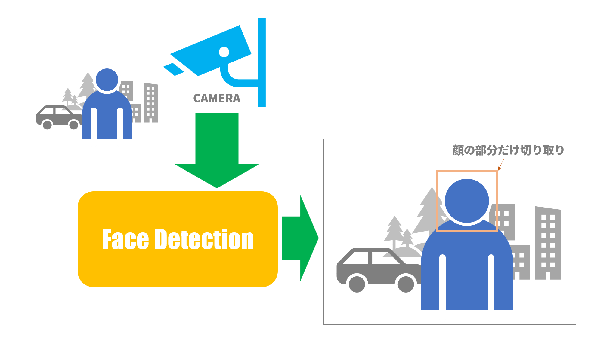
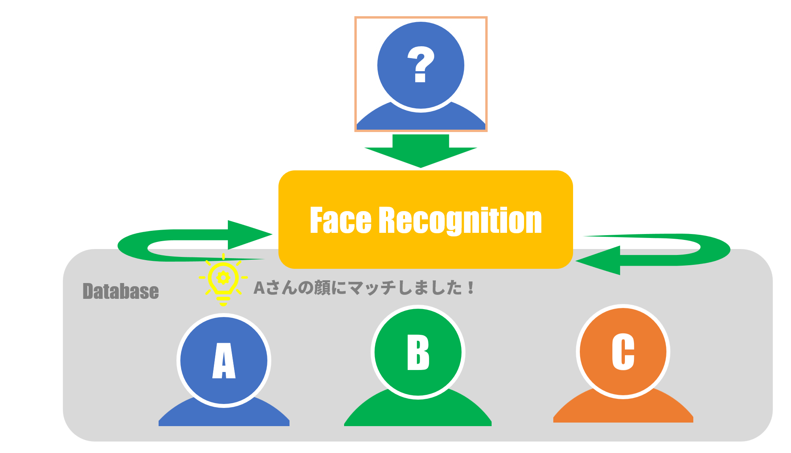
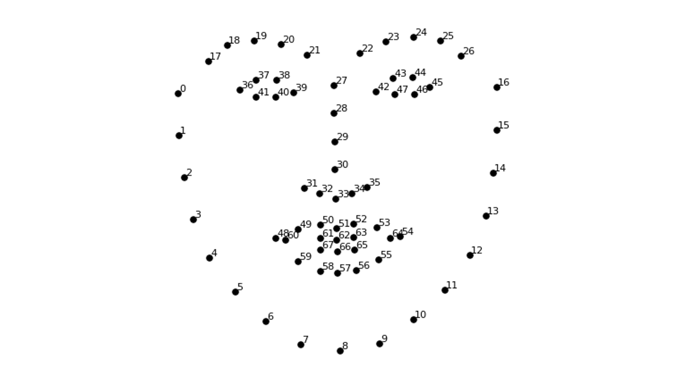
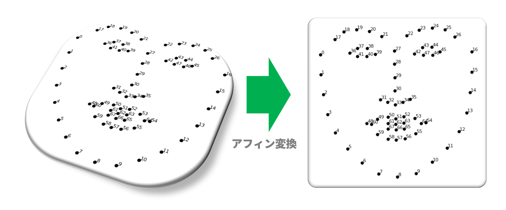
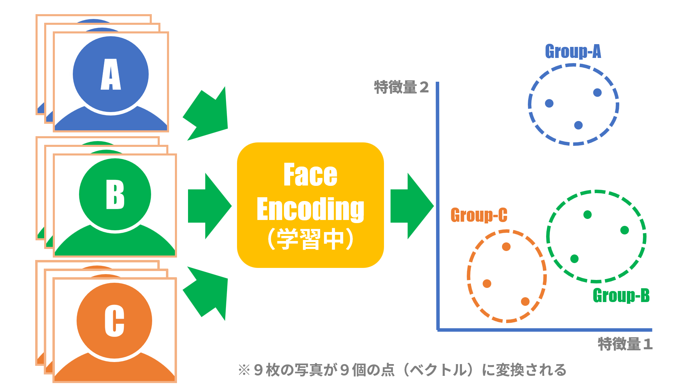
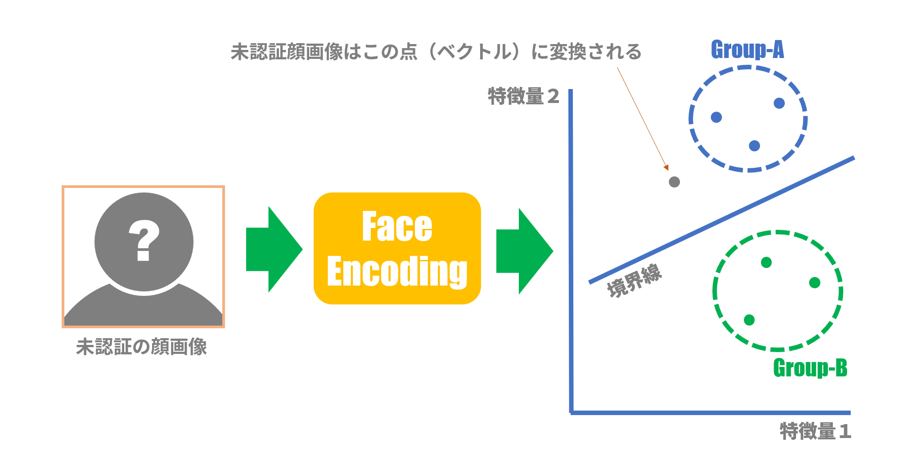

# EdgeTPUで顔認証してみる～方式編

## １．やりたいこと

あるエリアへの入退室管理で、ただカメラの前に立てば入退室が記録されるというシステムがあれば便利だと思います。しかも少ないコストで手軽に実現できればもっと良い。

そんな要求に答えるのがEdgeデバイスによる顔認証です。
顔認証はカメラ画像から顔の部分を切り出し、顔の特徴を抽出し、データベース内のラベル付けされた顔の特徴（前もって登録済みの）と比較します。比較の結果、一番類似している特徴に付けられたラベルの人がカメラの前に立っている人というわけです。

>Edgeデバイスとは：一般にインターネットに接続された末端機器を指しますが、ここではAIアクセラレータ付き開発ボードというニュアンスです。

## ２．Edgeデバイス比較

昨年来よりAIアクセラレータ付き開発ボードとして人気のある以下の２機種について、顔認証プログラムを軽く試してみました。

### （１）NVIDIA Jetson Nano Dev Board

 AIアクセラレータとして「Maxwell / 128 Cuda Cores」を使用しています。
 CUDAの設定をすれば簡単にAIアクセラレータを使用できる、一般的なGPU使用のイメージです。
 機械学習系のフレームワーク(OpenCV, face_recognition(dlib), Openface等）で素直にアクセラレータを使用できるので、ネット上で入手可能ないろいろな機械学習系プログラムをそこそこのスピードで簡単に動かすことができます。

### （２）Google Coral Dev Board

AIアクセラレータとして「EdgeTPU」を使用しています。
EdgeTPUは「Tensorflow Liteモデル」のみに対応しています。
したがって、機械学習系の各フレームワーク（Tensorflow以外の）で独自に使われているモデル（以下「モデル」と言えば「ニューラルネットワークモデル」を意味します）を使用する場合はアクセラレータが使われず、非力なCPUを用いて低速で実行されることになります。

実際、face_recognition(dlib)+opencvを用いた顔認証プログラムでは、カメラ画像内のバウンティングボックスが数秒おきにカクカク動くというくらいの低速ぶりでした。
また、本機は搭載OSからして「Mendel Linux」というDebianベースの独自OSで、ボードのセットアップは一癖も二癖もあり、とっつきやすい印象はありませんでした。

### さらなるEdgeTPU調査へ

というわけで、簡単かつそこそこの速度で機械学習系プログラムを動かしたいのならばJetson Nanoがお勧めです。しかし、EdgeTPUの実力を知らずしてCoral Dev Boardを使わないのも何か残念というか、もしかしたらすごく高速なのではという予感もあります。そこで、Coral Dev Board上でEdgeTPUを最大限に使って顔認識プログラムを動かすにはどうすればよいかを検討してみました。

## ３．顔認証のステップ

今のところ、ネットに落ちているプログラムを１つ拾ってきて、Coral Dev Boardにインストールして、カメラ画像から「顔認証できました！」というウマイ話は無いようです。
そこで、顔認証処理をいくつかのステップに分割し、各々のステップでEdgeTPUを使えそうかどうかを調べるというアプローチを取ることにします。

## 顔検出と顔認識
顔認証処理は、おおまかに「顔検出」と「顔認識」の２処理に分割されます。

・顔検出 (Face Detection)：カメラ画像において人の顔や背景から顔部分の領域を切り出す処理

・顔認識 (Face Recognition)：予め登録した顔データのリストから、特定の顔を1つ選ぶ処理

### ３．1．顔検出(Face Detection)

DeepLearningの華々しい研究分野として「物体検出(Object Detection)」があります。
顔検出は物体検出の応用例で、カメラ画像から顔の領域（顔を含む四角形）だけを切り出します。
物体検出では、例えば道路上の風景で「人」「自動車」「自転車」など大まかな分類は可能ですが、「人」であることは判っても「Aさん」なのか「Bさん」なのか「Cさん」なのかというレベルまでは分類できないようです。


><center>図１：カメラ画像から顔部分を切り出す</center>

物体検出は比較的時間のかかる処理ですが、人気の分野だけあって日々新たな方式が発表され処理速度、検出精度も向上しています。
ざっと以下の方式がありますが、おおまかな時代順に並べてみます：

* HOG(Histogram of Oriented Gradients)
* Image Segmentation (Felzenszwalb’s Algorithm)
* Selective Search
* R-CNNとその改良型
* YOLO(You Only Look Once)とその改良型
* SSD(Single Shot Detector)
* RetinaNet
* その他最新の手法

上記でYOLOやSSDはEdgeTPUでの実装例もあるようです。
各方式の詳細についてはここでは述べませんが、以下の参考文献[[1](https://lilianweng.github.io/lil-log/2017/10/29/object-recognition-for-dummies-part-1.html)][[2](https://qiita.com/mshinoda88/items/9770ee671ea27f2c81a9)]はよくまとまっています。

>参考文献：  
>[1] [Object Detection Part 1-4: Fast Detection Models](https://lilianweng.github.io/lil-log/2017/10/29/object-recognition-for-dummies-part-1.html)  
>[2] [物体検出についての歴史まとめ(1),(2)](https://qiita.com/mshinoda88/items/9770ee671ea27f2c81a9)  


### ３．2．顔認識(Face Recognition)

まず、顔検出で切り出された画像から顔の特徴データを抽出します。
ここで、顔認証システムでは認証対象となる人々の顔の特徴データが予めデータベースに登録されています。
各人の特徴データにはその人の名前がラベル付けされています。

認証処理は、顔検出画像から抽出された顔の特徴データが、データベース内の全特徴データの中のどれに
一番類似しているかを探し出し、その特徴データのラベルに書かれた名前が認証された人の名前となります。


><center>図２：どの顔が一番似ているかを探す</center>

以下に上記各処理の詳細について説明します。

顔認識については、以下のステップが一般的なようです。

#### （１）顔ランドマーク推定(Face Landmark Estimation)

顔検出で顔の画像を切り取ることはできました。しかし、その顔画像はちょっと斜めを向いていたりとか、必ずしも正面を向いていない可能性があります。そこで、顔画像を適当に動かして正面に向けて顔画像の正規化を実現するには、目とか鼻とか口とか何か「とっかかり」が欲しいところです。そのとっかかりに相当するのがランドマークです。

ランドマークとは顔の各パーツ、例えば目、鼻、口、輪郭等を点で表した情報です。
代表的なランドマーク例を図３に挙げます。


><center>図３：ランドマークの例</center>

この図ではランドマークを表す点の数が68個です。
各点の位置情報は２次元の点で表されるので、ランドマークは136次元(=68x2)のベクトルで表現できます。

ランドマークの計算方法としては参考文献[[3](http://www.csc.kth.se/~vahidk/papers/KazemiCVPR14.pdf)]がよく知られていますが、個人的には参考文献[[4](http://musyoku.github.io/2017/11/26/face-alignment-at-3000fps/)]が分かりやすかったです。
この手法は再帰木(Regression Tree)を用いて計算するようですが、
要するに一般的な機械学習であり、DeepLearningを使ったものではありません。
しかし、近年はDeepLearningを用いた手法も増えているようです。（参考文献[[5](https://qiita.com/RanWensheng/items/d8768395166d041a753a)]）
ランドマーク検出にDeepLearningを用いる場合、顔のパーツ毎にモデルを用意する必要があり、モデルの規模が大きくなりそうなのでEdgeデバイスに実装する場合は、ちょっとどうかなという感じです。

>参考文献：  
>[3] [One Millisecond Face Alignment with an Ensemble of Regression Trees](http://www.csc.kth.se/~vahidk/papers/KazemiCVPR14.pdf)  
>[4] [Face Alignment at 3000 FPS via Regressing Local Binary Features](http://musyoku.github.io/2017/11/26/face-alignment-at-3000fps/
)  
>[5] [顔ランドマーク検出論文サーベイ](https://qiita.com/RanWensheng/items/d8768395166d041a753a)  

#### （２）顔アラインメント(Face Alignment)

このステップでは正面顔画像（正確には正面に近い顔画像）を得るのが目的です。図４の左側は顔検出で得た画像のランドマークを示します。顔が斜め上を向いた画像だったのでランドマークは歪な形をしています。このランドマークに移動、回転、拡大・縮小、せん断(shear：四角形から平行四辺形に変形させるような変換)を施して、図４の右側の正面向きのランドマークに近くなるように変形します。このような変換をアフィン変換と呼びますが詳細は参考文献[[6](https://qiita.com/koshian2/items/c133e2e10c261b8646bf)]をご参照ください。


><center>図４：ランドマークをアフィン変換</center>

図4の左側から右側へ変換する過程において、アフィン変換による変換手順（移動、回転、拡大・縮小、せん断）、変換量が得られます。今度は顔検出で得られた顔画像に対して、先ほど得られた変換を施します。得られた顔画像は変換前に比べて正面向きに近い顔画像となります。

この変換に要する計算は単純な線形変換なのでDeepLearningの出る幕はありません。

>参考文献：  
>[6] [完全に理解するアフィン変換](https://qiita.com/koshian2/items/c133e2e10c261b8646bf)  

#### （３）顔エンコーディング(Face Encoding)

今までの処理によってやっと正規化された顔画像を得ることができました。ここではいよいよ顔を識別する処理を行います。
ある顔画像がAさんのなのかBさんなのかCさんなのかを知るために、その顔画像を顔の特徴を表すベクトルに変換します。
このベクトルを埋め込みベクトル(Embedding vector)と呼び、この変換操作を顔エンコーディングと呼びます。

>ベクトル化されることによって、何十万ピクセル以上もある画像情報がたかだか128個程度の数字に圧縮されます。

```Shell
埋め込みベクトル = [特徴量1, 特徴量2, 特徴量3, ... , 特徴量128] 

    例：[0.0972534532, 0.1803572034, -0.1144376703, ... , 0.1028145773]
```

ベクトルへの変換って何？というところですが、例えばAさんの写真を何枚か撮って各々の写真毎に埋め込みベクトルへ変換すると、Aさんの顔写真なのでみんな「類似」しています。そこで、埋め込みベクトル空間上にて、変換先の埋め込みベクトルは互いの距離が近いように配置します。逆にBさんの顔写真を変換した埋め込みベクトルはAさんの埋め込みベクトルからは距離的に遠いところに配置します。これを繰り返してニューラルネットに学習させると、埋め込みベクトル間の距離が近ければ「類似」していて、遠ければ「類似」していないという変換が実現します。

図５はAさん、Bさん、Cさん各々３枚の写真が、埋め込みベクトル空間でどのように配置（＝変換）されるかを示しています。
図５では説明のために埋め込みベクトル空間は2次元ですが、実際の埋め込みベクトル空間は128次元のものが多いので、多次元空間での点をご想像ください（難しいけど）。


><center>図５：顔エンコーディングのための学習</center>

この手の変換処理はDeepLearningが得意とするところで、顔の特徴量は人間が用意すること無しにニューラルネットが勝手に特徴を掴みます。
いろいろな実装例もDeepLearningを用いたものがほとんどです。参考文献として[[7](https://arxiv.org/abs/1503.03832)]がよく知られています。

>参考文献：  
>[7] [FaceNet: A Unified Embedding for Face Recognition and Clustering](https://arxiv.org/abs/1503.03832)  

#### （４）顔分類(Face Classification)

やっと最終ステップです。
顔分類は今カメラに写っている人の名前は何かを判定する処理です。
これは、言い換えれば、今カメラに写っている人の埋め込みベクトルが、データベース内の埋め込みベクトル群の中でどの埋め込みベクトル群に一番近いかを判定する処理です。
これにより、データベース内の全埋め込みベクトルとの距離を計算して比較する手間は省かれ、高速に判定することが可能となります。

図６はSVM(Support Vector Machine)という機械学習の手法を使って、新たに得られた埋め込みベクトルがAさんのグループに近いのか、Bさんのグループに近いのかを判定する様子を示しています。SVMは予め学習によってAさんグループとBさんグループの境界線を設けておき、新たなベクトルが境界線のどちら側にあるかを判定することによって、どちらのグループに属するかを判定します。図６の例では境界線の上側なのでAさんグループに属すると判定します。


><center>図６：SVMによる判定例</center>

図６では説明のために埋め込みベクトル空間は2次元ですが、実際の埋め込みベクトル空間は128次元のものが多いです。したがって図６の境界線は、実際には多次元空間での超平面となります。

この処理では、線形SVM(Support Vector Machine)やK近傍法(K-means法)等々の一般的な機械学習手法が使われることがほとんどです。
わざわざDeepLearningのような重い処理をする必要は無いようです。
SVMやK近傍法については、一般的な手法ですのでいろいろなところで解説されています。そちらをご参照ください。

## ４．EdgeTPU使用の検討

最後に上記の各ステップについて、EdgeTPU使用の観点からまとめます。処理量が大きいと予想される、顔検出（Step1）と顔エンコーディング（Step4）においてEdgeTPUが使用できそうなので、EdgeTPUの効果は期待できるかもしれません。

### Step1.  顔検出(Face Detection)
* EdgeTPUを使用できそう
* Tensorflow Lite Modelによる実装例あり（参考文献[[8](https://github.com/guichristmann/edge-tpu-tiny-yolo)][[9](https://github.com/goruck/edge-tpu-servers)]：前者はYOLOv3ベース、後者はSSDベース）

### Step2. 顔ランドマーク推定(Face Landmark Estimation)
* EdgeTPUは使用しない（DeepLearningを使用すれば重い処理になりそう）
* face_recognition(dlib)、OpenCVのライブラリで簡単に実現可能

### Step3. 顔アラインメント(Face Alignment)
* EdgeTPUは使用しない（DeepLearningを使用するまでもない軽い処理）
* face_recognition(dlib)、OpenCVのライブラリで簡単に実現可能

### Step4. 顔エンコーディング(Face Encoding)
* EdgeTPUを使用できるかもしれない
* FacenetライブラリがTensorflowベースで記述されている。  
TensorflowモデルがTensorflow Liteモデルに変換できればEdgeTPUが使用できるかもしれない

### Step5. 顔分類(Face Classification)
* EdgeTPUは使用しない（DeepLearningを使用するまでもない軽い処理）
* face_recognition(dlib)、OpenCVのライブラリで簡単に実現可能

><center>表１：EdgeTPU使用箇所まとめ</center>

|Step|処理名|処理量|NVIDIA Jetson Nano Dev Board|Google Coral Dev Board|
|:---|:---|:---:|:---|:---|
|Step1|顔検出|大|OpenCV, face_recognition(dlib), Openface等|EdgeTPU(Tensorflow Lite)|
|Step2|顔ランドマーク推定|中|OpenCV, face_recognition(dlib), Openface等|OpenCV, face_recognition(dlib), Openface等|
|Step3|顔アラインメント|小|OpenCV, face_recognition(dlib), Openface等|OpenCV, face_recognition(dlib), Openface等|
|Step4|顔エンコーディング|大|OpenCV, face_recognition(dlib), Openface等|EdgeTPU(FaceNet, Tensorflow Lite)|
|Step5|顔分類|小|OpenCV, face_recognition(dlib), Openface等|OpenCV, face_recognition(dlib), Openface等|


>参考文献：  
>[5] [guichristmann/edge-tpu-tiny-yolo(EdgeTPU-Tiny YOLOv3)](https://github.com/guichristmann/edge-tpu-tiny-yolo)  
>[6] [goruck/edge-tpu-servers](https://github.com/goruck/edge-tpu-servers)  

## ５．続きは？
次は実装編です。いよいよ顔検出(Face Detection)をCoral Dev Boardに実装していきます。乞うご期待！

